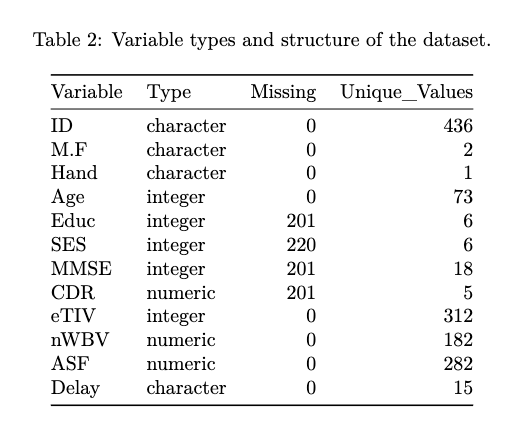
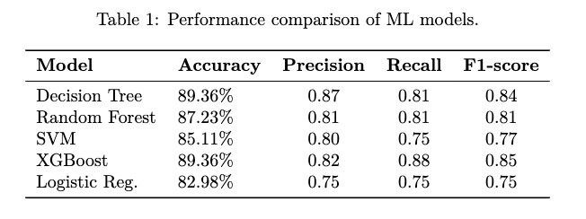

# Project Background

Alzheimer’s disease is the most common cause of dementia. While no cure currently exists for later stages, evidence suggests that modifying certain lifestyle and health-related risk factors can help reduce or delay the onset of dementia in some individuals. Therefore, early intervention is valuable in primary healthcare. An early-stage prediction model can help professionals recognis individuals at risk, allowing them to access appropriate treatments, make lifestyle changes, and slow disease progression through timely intervention.

Diagnosing Alzheimer’s disease early is challenging because early brain changes are subtle and may not be obvious clinically. Machine learning (ML) models can support this process by identifying patterns in data that indicate risk before symptoms become significant.

This project supports the first two stages of the Well Pathway for Dementia by developing and evaluating five machine learning classification models to determine which achieves the highest accuracy in predicting dementia status (demented vs. nondemented) based on clinical and demographic metrics. It also includes exploratory data analysis (EDA), visualisations, and interpretation of factors associated with dementia status.

The original study is available at [here](https://www.frontiersin.org/journals/public-health/articles/10.3389/fpubh.2022.853294/full).

# Dataset Overview & Structure

The dataset used for this project is the Longitudinal MRI Data in Nondemented and Demented Older Adults, available at [here](https://www.kaggle.com/datasets/jboysen/mri-and-alzheimers).

Cross-sectional MRI database contains 436 records, and its structure is shown below. These features represent known biomarkers associated with Alzheimer’s pathology.

Before beginning the analysis, several preliminary checks were performed to ensure data accuracy, including handling missing values, reviewing attribute definitions, and generating descriptive statistical summaries. A detailed summary of these diagnostics can be found [here](./Datasets.pdf).

# Executive Summary

The model’s performance was evaluated using Accuracy, Precision, and Recall, as shown in the table below.

The **XGBoost model** is the strongest and most clinically reliable candidate for early-stage Alzheimer's disease prediction. 

This model achieved a competitive overall Accuracy of 89.36%, a peak score shared with the Decision Tree (DT) model. The decisive advantage is XGBoost's superior Recall of $0.88$, which is vital because it minimizes False Negatives (the critical error of missing a diagnosis). While DT maintains slightly higher Precision ($0.87$), XGBoost delivers a strong and reliable Precision of $0.82$. This exceptional Recall score makes minimizing False Negatives the deciding factor for safety and reliability in early-stage Alzheimer's disease detection, ensuring that patients and their caregivers can proceed immediately with crucial early intervention or treatment planning.

Detailed findings and insights (Visualizations & Confusion matrices) can be found [here](./modelperformance.pdf)

* A limitation of this study is that dementia status was defined solely from CDR rather than a full clinical diagnostic protocol, and observations with missing CDR values were excluded because a valid outcome label could not be assigned. In addition, the dataset is relatively small, so the resulting model estimates and accuracy metrics should be interpreted with caution

# Insights Deep Dive
### Category 1:

* **Main insight 1.** More detail about the supporting analysis about this insight, including time frames, quantitative values, and observations about trends.
  
* **Main insight 2.** More detail about the supporting analysis about this insight, including time frames, quantitative values, and observations about trends.
  
* **Main insight 3.** More detail about the supporting analysis about this insight, including time frames, quantitative values, and observations about trends.
  
* **Main insight 4.** More detail about the supporting analysis about this insight, including time frames, quantitative values, and observations about trends.

[Visualization specific to category 1]

### Category 2:

* **Main insight 1.** More detail about the supporting analysis about this insight, including time frames, quantitative values, and observations about trends.
  
* **Main insight 2.** More detail about the supporting analysis about this insight, including time frames, quantitative values, and observations about trends.
  
* **Main insight 3.** More detail about the supporting analysis about this insight, including time frames, quantitative values, and observations about trends.
  
* **Main insight 4.** More detail about the supporting analysis about this insight, including time frames, quantitative values, and observations about trends.

[Visualization specific to category 2]

### Category 3:

* **Main insight 1.** More detail about the supporting analysis about this insight, including time frames, quantitative values, and observations about trends.
  
* **Main insight 2.** More detail about the supporting analysis about this insight, including time frames, quantitative values, and observations about trends.
  
* **Main insight 3.** More detail about the supporting analysis about this insight, including time frames, quantitative values, and observations about trends.
  
* **Main insight 4.** More detail about the supporting analysis about this insight, including time frames, quantitative values, and observations about trends.

[Visualization specific to category 3]

### Category 4:

* **Main insight 1.** More detail about the supporting analysis about this insight, including time frames, quantitative values, and observations about trends.
  
* **Main insight 2.** More detail about the supporting analysis about this insight, including time frames, quantitative values, and observations about trends.
  
* **Main insight 3.** More detail about the supporting analysis about this insight, including time frames, quantitative values, and observations about trends.
  
* **Main insight 4.** More detail about the supporting analysis about this insight, including time frames, quantitative values, and observations about trends.

[Visualization specific to category 4]

# Recommendations:

Based on the insights and findings above, we would recommend the [stakeholder team] to consider the following: 

* Specific observation that is related to a recommended action. **Recommendation or general guidance based on this observation.**
  
* Specific observation that is related to a recommended action. **Recommendation or general guidance based on this observation.**
  
* Specific observation that is related to a recommended action. **Recommendation or general guidance based on this observation.**
  
* Specific observation that is related to a recommended action. **Recommendation or general guidance based on this observation.**
  
* Specific observation that is related to a recommended action. **Recommendation or general guidance based on this observation.**
  

# Assumptions and Caveats:

Throughout the analysis, multiple assumptions were made to manage challenges with the data. These assumptions and caveats are noted below:

* Assumption 1 (ex: missing country records were for customers based in the US, and were re-coded to be US citizens)
  
* Assumption 1 (ex: data for December 2021 was missing - this was imputed using a combination of historical trends and December 2020 data)
  
* Assumption 1 (ex: because 3% of the refund date column contained non-sensical dates, these were excluded from the analysis)
